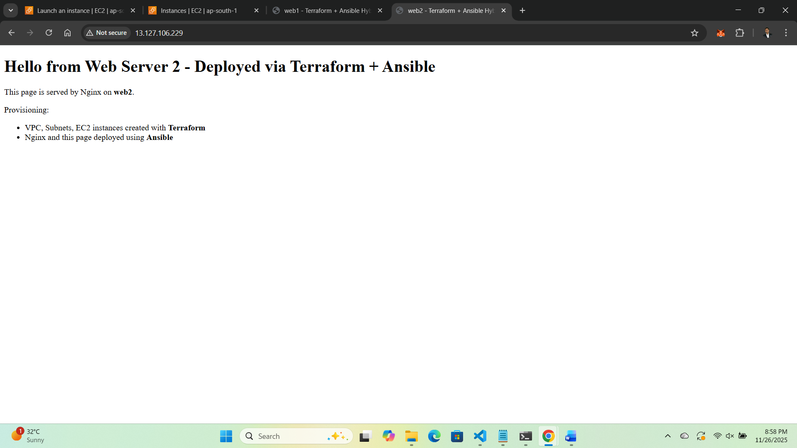

# Terraform + Ansible Hybrid Automation Project

## 📌 Project Overview
This project demonstrates a hybrid Infrastructure as Code (IaC) approach where:

- Terraform provisions AWS infrastructure
- Ansible configures EC2 instances
- Nginx is installed and a custom web page is deployed automatically

## 🛠️ Tech Stack
- Terraform
- Ansible
- AWS EC2, VPC
- Ubuntu Linux
- Nginx

## 🗂️ Project Structure
hybrid-iac/
├── terraform/
│ ├── main.tf
│ ├── variables.tf
│ ├── outputs.tf
│ └── inventory.tpl
└── ansible/
├── site.yml
└── templates/
└── index.html.j2


## 🚀 How It Works
1. Terraform creates:
   - A VPC
   - Two public subnets
   - Two EC2 instances

2. Terraform generates a dynamic inventory for Ansible.

3. Ansible connects to EC2 and:
   - Installs Nginx
   - Deploys custom `index.html`

## ⚙️ How to Run

### Prerequisites
- AWS account
- AWS CLI configured
- Terraform installed
- Ansible installed

### Steps

```bash
cd terraform
terraform init
terraform apply

cd ../ansible
ansible-playbook -i inventory.ini site.yml
```

### ✅ Expected Output

Two public IPs showing different Nginx web pages.

## 📸 Screenshots

### Web Server 1


### Web Server 2


Save it.


## 3. Create `.gitignore` (very important)

To avoid leaking secrets and state files.

```bash
nano .gitignore
```


